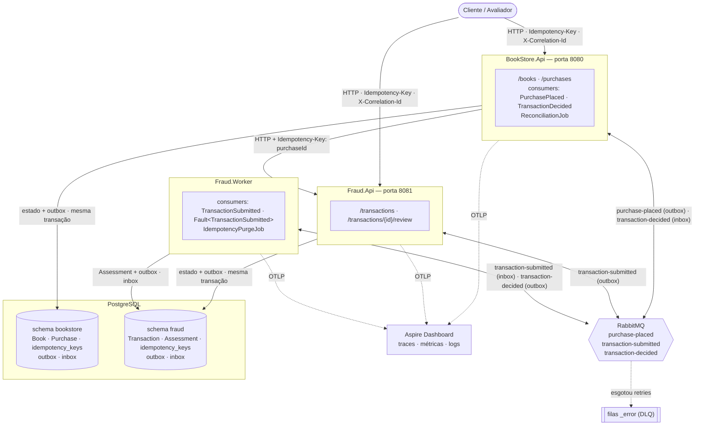
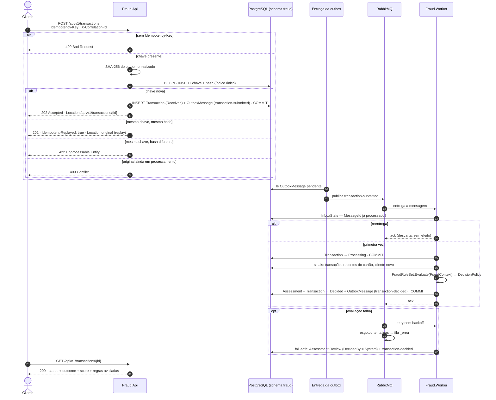

# 📚🛡️ BookStore — Módulo Antifraude

> Um **marketplace de livros** que só confirma uma venda depois que um **módulo antifraude** avalia a
> transação e decide entre `APPROVED`, `REJECTED` ou `REVIEW`. A solução é **idempotente**,
> **resiliente** e **auditável** — e cada uma dessas palavras está provada em código, teste e documento.

**Stack:** .NET 10 · ASP.NET Core · EF Core · PostgreSQL · RabbitMQ · MassTransit · OpenTelemetry ·
Aspire · Docker

---

## 📑 Sumário

- [🎯 O desafio e onde cada item é atendido](#-o-desafio-e-onde-cada-item-é-atendido)
- [🚀 How to use](#-how-to-use)
- [🏗️ Visão geral](#️-visão-geral)
- [🔄 Fluxo de ponta a ponta](#-fluxo-de-ponta-a-ponta)
- [🧠 Regras antifraude](#-regras-antifraude)
- [🛟 Resiliência](#-resiliência)
- [🔁 Idempotência e deduplicação](#-idempotência-e-deduplicação)
- [🔭 Observabilidade](#-observabilidade)
- [🧾 Auditoria](#-auditoria)
- [📜 Contrato de API](#-contrato-de-api)
- [⚙️ Configuração](#️-configuração)
- [🧭 Decisões arquiteturais (ADRs)](#-decisões-arquiteturais-adrs)
- [🗂️ Estrutura do repositório](#️-estrutura-do-repositório)
- [🧪 Testes](#-testes)
- [🤖 Uso de IA no processo](#-uso-de-ia-no-processo)
- [🔮 Evoluções](#-evoluções)

---

## 🎯 O desafio e onde cada item é atendido

| Item pedido | Onde está |
| :--- | :--- |
| Visão geral (arquitetura, componentes) | [🏗️ Visão geral](#️-visão-geral) · [diagrama de componentes](docs/diagramas/01-componentes.md) |
| Fluxo de ponta a ponta | [🔄 Fluxo](#-fluxo-de-ponta-a-ponta) · [diagramas de sequência](docs/diagramas/02-sequencia.md) |
| Resiliência (retry, backoff, DLQ, fallback) | [🛟 Resiliência](#-resiliência) |
| Idempotência e deduplicação | [🔁 Idempotência](#-idempotência-e-deduplicação) · [ADR-0004](docs/adr/0004-idempotencia-e-deduplicacao.md) |
| Observabilidade (métricas, logs, tracing) | [🔭 Observabilidade](#-observabilidade) · [ADR-0005](docs/adr/0005-observabilidade-e-correlacao.md) |
| Diagrama de componentes/containers | [01-componentes](docs/diagramas/01-componentes.md) |
| Diagrama de sequência | [02-sequencia](docs/diagramas/02-sequencia.md) |
| ADR — mensageria | [ADR-0002](docs/adr/0002-mensageria.md) |
| ADR — banco de dados | [ADR-0003](docs/adr/0003-banco-de-dados.md) |
| ADR — idempotência/dedup | [ADR-0004](docs/adr/0004-idempotencia-e-deduplicacao.md) |
| ADR — deployment *(extra)* | [ADR-0007](docs/adr/0007-deploy.md) |
| `POST /transactions` com `Idempotency-Key` | [contrato](docs/api/contrato.md#post-apiv1transactions) |
| `GET /transactions/{id}` | [contrato](docs/api/contrato.md#get-apiv1transactionsid) |

**Além do pedido:** diagramas de [entidades](docs/diagramas/03-entidades.md) e de
[estados](docs/diagramas/04-estados.md), ADRs de [processamento assíncrono](docs/adr/0001-processamento-assincrono.md),
[versionamento](docs/adr/0006-versionamento-da-api.md), [regras antifraude](docs/adr/0008-regras-antifraude.md) e
[arquitetura três processos](docs/adr/0010-arquitetura-dois-servicos.md),
marketplace consumidor do antifraude, revisão humana, reconciliação, testes e execução com um comando.

---

## 🚀 How to use

### 📋 Pré-requisitos

- **Docker Desktop 24+** com `docker compose` v2 (incluso)
- Portas livres: `5432` (PostgreSQL), `5672` / `15672` / `15692` (RabbitMQ), `8080` (BookStore.Api), `8081` (Fraud.Api), `18888` / `18889` (Aspire Dashboard), `9090` (Prometheus), `3000` (Grafana)

### ▶️ Subindo o ambiente

```bash
# copie o arquivo de variáveis de ambiente
cp deploy/.env.example deploy/.env

# sobe todos os serviços e aguarda ficarem saudáveis (caminho principal)
docker compose up -d --build --wait

# alternativa equivalente a partir do subdiretório
# docker compose -f deploy/docker-compose.yml up -d --build --wait
```

> ⚠️ Não suba o Aspire e o Docker Compose ao mesmo tempo — eles compartilham portas: `5432`, `5672`, `15672`, `8080`, `8081`.

Na primeira execução `BookStore.Api` aplica as migrations do schema `bookstore` e popula o catálogo (`Database__ApplyMigrationsOnStartup=true`, `Seeding__Enabled=true`); `Fraud.Api` aplica as migrations do schema `fraud`.

### 🔗 Endereços

| Serviço | URL |
| :--- | :--- |
| 📘 Swagger UI — Marketplace | http://localhost:8080/swagger |
| 📘 Swagger UI — Antifraude | http://localhost:8081/swagger |
| 🔭 Aspire Dashboard | http://localhost:18888 |
| 🐇 RabbitMQ Management | http://localhost:15672 (guest / guest) |
| 📈 Prometheus | http://localhost:9090 |
| 📊 Grafana | http://localhost:3000 (admin / admin) |

### ▶️ Subindo com Aspire (desenvolvimento)

```bash
dotnet run --project apps/Aspire
```

O Aspire Dashboard abre automaticamente. As portas dos serviços são atribuídas dinamicamente — consulte o painel para os URLs exatos.

### 📮 Postman

1. Importe `docs/postman/BookStore.postman_collection.json`
2. Importe e selecione o ambiente correspondente ao stack:
   - `docs/postman/local.postman_environment.json` — **BookStore — Local (Docker)**
     (`bookstoreUrl = http://localhost:8080` · `fraudUrl = http://localhost:8081`)
   - `docs/postman/local-aspire.postman_environment.json` — **BookStore — Local (Aspire)**
     (portas dinâmicas — ajuste conforme o painel Aspire)
3. Execute os cenários na ordem abaixo

### 🎬 Roteiro de cenários

| # | Cenário | Resultado esperado | Como executar |
| :---: | :--- | :--- | :--- |
| S1 | livro físico, valor baixo, cliente com histórico | ✅ `APPROVED` → compra `CONFIRMED` | Execute **S1.1** → aguarde ~7 s → execute **S1.2** |
| S2 | e-book caro, cliente novo | ❌ `REJECTED` → compra `CANCELLED` | Execute **S2.1** (Pragmatic ×2, cliente novo) → aguarde → **S2.2** |
| S3 | 10 unidades do mesmo livro | 🔍 `REVIEW` → compra `UNDER_REVIEW` | Execute **S3.1** (Clean Code ×10) → aguarde → **S3.2** |
| S4 | revisor aprova o S3 | ✅ compra `CONFIRMED` | Execute **S4.1** → **S4.2** (outcome APPROVED) → **S4.3** |
| S5 | 5 compras seguidas com o mesmo cartão | primeiras aprovadas, 6ª barrada | Execute **S5.1–S5.5** (histórico) → **S5.6** → aguarde → **S5.7** |
| S6 | reenvio com a mesma `Idempotency-Key` | 🔁 mesma resposta, nenhuma compra nova | Execute **S6** (usa a chave salva de S1) |
| S7 | mesma chave, corpo diferente | ⚠️ `422` | Execute **S7** (mesma chave de S1, body diferente) |
| S8 | sem `Idempotency-Key` | ⚠️ `400` | Execute **S8** |
| S9 | parar o Fraud.Worker, comprar, religar | 🛟 compra conclui sozinha ao religar | `docker compose stop fraud-worker` → faça uma compra → `docker compose start fraud-worker` → aguarde → compra finaliza |
| S10 | valor muito acima da média do cliente | 🔍 `REVIEW` | Execute **S10.1–S10.3** (histórico) → aguarde → **S10.4** → **S10.5** |
| S11 | três compras logo abaixo de um limite | 🔍 `REVIEW` | Execute **S11.1–S11.3** (R$ 475, R$ 480, R$ 490) → aguarde → **S11.4** |

---

## ⚙️ Configuração

Copie `deploy/.env.example` para `deploy/.env` e ajuste os valores. Todos têm fallback seguro no
`docker-compose.yml`; para um override pontual sem editar o arquivo use a sintaxe
`VAR=valor docker compose up`.

| Variável | Padrão | Descrição |
| :--- | :---: | :--- |
| `POSTGRES_USER` | `bookstore` | Usuário PostgreSQL |
| `POSTGRES_PASSWORD` | `bookstore` | Senha PostgreSQL |
| `POSTGRES_DB` | `bookstore` | Nome do banco |
| `RABBITMQ_USER` | `guest` | Usuário RabbitMQ |
| `RABBITMQ_PASS` | `guest` | Senha RabbitMQ |
| `ASPNETCORE_ENVIRONMENT` | `Development` | `Development` exibe stack traces; `Production` os omite |
| `DEMO_FRAUD_DELAY_SECONDS` | `5` | Pausa artificial do Worker na fase de processamento (0 = desativado) |
| `RECONCILIATION_INTERVAL_SECONDS` | `30` | Com que frequência o job de reconciliação é executado |
| `RECONCILIATION_STALENESS_SECONDS` | `60` | Idade mínima (em segundos) de uma compra parada para ser reconciliada |
| `GRAFANA_ADMIN_USER` | `admin` | Usuário administrador do Grafana |
| `GRAFANA_ADMIN_PASSWORD` | `admin` | Senha do administrador do Grafana |
| `PROMETHEUS_PORT` | `9090` | Porta host do Prometheus (override opcional) |
| `GRAFANA_PORT` | `3000` | Porta host do Grafana (override opcional) |
| `RABBITMQ_PROM_PORT` | `15692` | Porta host do endpoint Prometheus do RabbitMQ (override opcional) |

---

## 🏗️ Visão geral

**Três processos independentes** compartilhando o mesmo código-fonte (`src/`), com dois bounded
contexts — **BookStore** (catálogo + compras) e **Fraud** (análise antifraude):

- **BookStore.Api** — marketplace: livros, compras, reconciliação. Chama Fraud.Api via HTTP.
- **Fraud.Api** — antifraude: recebe transações, expõe revisão manual.
- **Fraud.Worker** — avaliação assíncrona: regras, decisão, atualiza compras via mensagem.

Cada processo é dono exclusivo do seu `DbContext` e do seu schema no PostgreSQL (`bookstore` ou
`fraud`). A divisão resolve o bug de race condition do MassTransit 8.5.x com dois outboxes no mesmo
bus (ver [ADR-0010](docs/adr/0010-arquitetura-dois-servicos.md)).

<!-- sincronizado de docs/diagramas/01-componentes.md -->


📄 Detalhes e justificativas: [diagrama de componentes](docs/diagramas/01-componentes.md) ·
[entidades](docs/diagramas/03-entidades.md) · [estados](docs/diagramas/04-estados.md)

---

## 🔄 Fluxo de ponta a ponta

1. O comprador envia `POST /api/v1/purchases` com `Idempotency-Key` ao **BookStore.Api**.
2. O BookStore.Api grava **na mesma transação** a chave, a compra (`PendingFraudCheck`) e a mensagem
   de saída, e responde `202 Accepted` + `Location`.
3. A outbox entrega `purchase-placed`; o `PurchasePlacedConsumer` chama `POST /api/v1/transactions`
   na **Fraud.Api** com `Idempotency-Key: {purchaseId}`.
4. A Fraud.Api grava a transação (`Received`) + outbox e responde `202`. A outbox entrega
   `transaction-submitted` ao RabbitMQ.
5. O **Fraud.Worker** consome, avalia com as regras antifraude e publica `transaction-decided`.
6. O BookStore.Api consome `transaction-decided` e confirma, cancela ou coloca a compra em revisão.

<!-- sincronizado de docs/diagramas/02-sequencia.md (fluxo 1) -->


📄 O fluxo completo BookStore.Api → Fraud.Api → Fraud.Worker → BookStore.Api está no
[fluxo 2](docs/diagramas/02-sequencia.md#2-compra-de-livro-de-ponta-a-ponta).

---

## 🧠 Regras antifraude

Cada regra é uma classe que implementa `IFraudRule`. O `FraudRuleSet` executa todas e soma os pesos; a
`DecisionPolicy` converte a pontuação em `APPROVED`, `REVIEW` ou `REJECTED`. As regras são puras (sem
acesso a banco) e cada uma registra código, versão, peso e motivo — disparando ou não.

| Regra | Detecta | Cenário |
| :--- | :--- | :---: |
| `HighValueDigitalRule` | valor alto em entrega digital | S2 |
| `NewCustomerHighAmountRule` | cliente sem histórico com valor alto | S2 |
| `BulkQuantityRule` | muitas unidades do mesmo item | S3 |
| `CardVelocityRule` | muitas transações do mesmo cartão em pouco tempo | S5 |
| `AmountDeviationRule` | valor muito acima da média do próprio cliente | S10 |
| `StructuringRule` | fracionamento logo abaixo de um limite | S11 |

📄 [ADR-0008 — Regras antifraude](docs/adr/0008-regras-antifraude.md)

---

## 🛟 Resiliência

| Mecanismo | O que faz |
| :--- | :--- |
| 📤 **Outbox transacional** | estado e mensagem gravados juntos; se o broker cair, a mensagem espera na tabela |
| 🔁 **Retry com backoff** | reprocessa falhas passageiras em intervalos crescentes |
| ☠️ **DLQ** (filas `_error`) | guarda a mensagem que esgotou as tentativas, sem perdê-la |
| 🧯 **Fallback fail-safe** | se a avaliação falha de vez, a transação recebe `REVIEW` (decidida pelo sistema) — nunca aprovação às cegas |
| 🧹 **Reconciliação** | job que republica compras paradas em `PENDING_FRAUD_CHECK` — seguro por idempotência |

📄 [ADR-0001](docs/adr/0001-processamento-assincrono.md) · [ADR-0002](docs/adr/0002-mensageria.md)

---

## 🔁 Idempotência e deduplicação

Repetir qualquer operação, em qualquer ponto, produz o mesmo resultado que executá-la uma vez.

| Onde | Mecanismo |
| :--- | :--- |
| `POST` de transações e compras | `Idempotency-Key` + hash do corpo, gravados na mesma transação do dado (índice único) |
| Consumidores | inbox (descarta o mesmo `MessageId`) |
| Casos de uso | checagem de estado antes de agir |
| Marketplace → antifraude | `Idempotency-Key = PurchaseId` |
| Reconciliação | republica com a mesma chave |

Respostas HTTP conforme o draft IETF `Idempotency-Key`: `400` sem chave · replay com a mesma chave e o
mesmo corpo · `422` com corpo diferente · `409` com a original ainda em execução.

📄 [ADR-0004 — Idempotência e deduplicação](docs/adr/0004-idempotencia-e-deduplicacao.md)

---

## 🔭 Observabilidade

- **Tracing** — OpenTelemetry, com `traceparent` atravessando HTTP e RabbitMQ: uma compra é um trace.
- **Logs estruturados** — *message templates* com `CorrelationId`, ids de recurso e `TraceId`; nunca
  dado de cartão.
- **Métricas** — técnicas (HTTP, banco, fila) e de negócio: transações recebidas, decisões por
  resultado, disparos por regra, tempo até a decisão, compras por status, reenvios idempotentes.
- **Correlação** — `X-Correlation-Id` no header; persistido e propagado. O `traceId` descreve uma
  execução; o `CorrelationId`, o fluxo de negócio inteiro (inclusive revisão e reconciliação).

📄 [ADR-0005 — Observabilidade e correlação](docs/adr/0005-observabilidade-e-correlacao.md)

---

## 🧾 Auditoria

- Decisões **nunca são sobrescritas**: cada avaliação é um novo registro; a vigente é a mais recente.
- Cada avaliação guarda **quem decidiu** (motor, sistema ou revisor), **quando**, **pontuação** e o
  resultado de **todas** as regras, com código, **versão** e motivo.
- O `GET /api/v1/transactions/{id}` expõe a decisão vigente e o histórico completo.

---

## 📜 Contrato de API

Base path `/api/v1`. Erros em *Problem Details* (RFC 9457).

| Serviço | Endpoint | |
| :--- | :--- | :---: |
| 🛡️ Antifraude | `POST /api/v1/transactions` | exigido |
| 🛡️ Antifraude | `GET /api/v1/transactions/{id}` | exigido |
| 🛡️ Antifraude | `POST /api/v1/transactions/{id}/review` | extra |
| 📚 Marketplace | `GET /api/v1/books` | extra |
| 📚 Marketplace | `POST /api/v1/purchases` | extra |
| 📚 Marketplace | `GET /api/v1/purchases/{id}` | extra |

📄 [Contrato completo](docs/api/contrato.md)

---

## 🧭 Decisões arquiteturais (ADRs)

| ADR | Decisão |
| :--- | :--- |
| [0001](docs/adr/0001-processamento-assincrono.md) | Processamento assíncrono com outbox |
| [0002](docs/adr/0002-mensageria.md) | RabbitMQ + MassTransit |
| [0003](docs/adr/0003-banco-de-dados.md) | PostgreSQL, dois schemas, EF Core |
| [0004](docs/adr/0004-idempotencia-e-deduplicacao.md) | Idempotência em cinco pontos |
| [0005](docs/adr/0005-observabilidade-e-correlacao.md) | OpenTelemetry e correlação |
| [0006](docs/adr/0006-versionamento-da-api.md) | Versionamento por URL |
| [0007](docs/adr/0007-deploy.md) | Containers + compose; Kubernetes em produção *(extra)* |
| [0008](docs/adr/0008-regras-antifraude.md) | Regras antifraude |
| [0010](docs/adr/0010-arquitetura-dois-servicos.md) | Três processos independentes (resolve bug MassTransit dual-outbox) |

---

## 🗂️ Estrutura do repositório

```text
apps/
  Aspire/           orquestração de desenvolvimento (Aspire AppHost)
  BookStore.Api/    HTTP — marketplace: livros, compras, reconciliação (porta 8080)
  Fraud.Api/        HTTP — antifraude: transações, revisão (porta 8081)
  Fraud.Worker/     consumidores de fraude + limpeza de chaves de idempotência
src/
  Domain/           entidades e regras, por contexto (Catalog, Sales, FraudAnalysis)
  Application/      casos de uso: UseCases/<Contexto>/<CasoDeUso>/
  Infrastructure/   Persistence/<DbContext>/ · Extensions/ · Options/ · Adapters/
  Web/              middleware, filtros e extensões ASP.NET Core compartilhados entre as APIs
tests/              Tests.Shared · Tests.Domain · Tests.Application · Tests.WebApi ·
                    Tests.Infrastructure
deploy/             docker-compose.yml · .env.example
docs/               adr/ · diagramas/ · api/ · postman/
```

---

## 🧪 Testes

```bash
# unitários (sem Docker — rápido):
dotnet test BookStore.slnx --filter "TestCategory=Unit"

# integrados (requer Docker — Testcontainers sobe PostgreSQL automaticamente):
dotnet test BookStore.slnx

# apenas infraestrutura (models, migrations):
dotnet test tests/Tests.Infrastructure

# apenas um contexto:
dotnet test tests/Tests.Application
```

Cobertura por camada: **Domain** (invariantes de entidades, regras de fraude), **Application** (handlers com repositórios substituídos), **WebApi** (serialização, idempotência HTTP), **Infrastructure** (configuração dos modelos EF, idempotência em banco real).

---

## 🤖 Uso de IA no processo

O enunciado permite IA. Usei como **ferramenta de execução sob o meu comando**, não como autora das decisões.

**Divisão de papéis**
- **Eu:** decidi a arquitetura, criei a estrutura inicial da solução, escrevi os requisitos, os ADRs, os
  diagramas e o contrato de API *antes* do código, e defini o plano de testes.
- **IA:** organizou os requisitos comigo numa âncora de decisões e executou o plano como agente, task a task.

**Como foi orquestrado**
- Requisitos e decisões num vault (Obsidian), convertidos em épicos → stories → tasks com critério de aceite.
- O agente (Claude) executou seguindo o prompt e as tasks em [`contexto/`](contexto/README.md), com a documentação
  como fonte da verdade.
- A sincronização vault ⇄ repositório foi feita pelo **Karawara**, uma ferramenta própria (CLI/MCP em .NET).

**Como validei**
- Testes unitários e de integração (Postgres real via Testcontainers) e um plano de testes manual definido na fase
  de documentação.
- A revisão manual encontrou defeitos que o agente havia marcado como concluídos — o outbox desligado (um teste com
  o RabbitMQ fora mostrou a perda de mensagem), consumers que engoliam falhas e, depois da separação em serviços,
  eventos publicados após o commit (a revisão manual não chegava à compra). Cada achado virou correção e foi
  revalidado com os mesmos testes.

**Ferramentas:** Claude · Obsidian · Rider · Karawara.

---

## 🔮 Evoluções

- ☸️ **Kubernetes** — API com autoescala por requisições; Worker por tamanho da fila (KEDA).
- 🧮 **Parâmetros de regra externos** — com versão derivada do hash dos parâmetros.
- 🤖 **Score de machine learning** — como mais uma `IFraudRule`, sem mudar a arquitetura.
- 🤝 **Conluio comprador–vendedor** — exige modelar vendedores no marketplace.
- 🔐 **Autenticação** — revisor identificado pelo token; `fraudDetails` restrito a operadores de risco.
