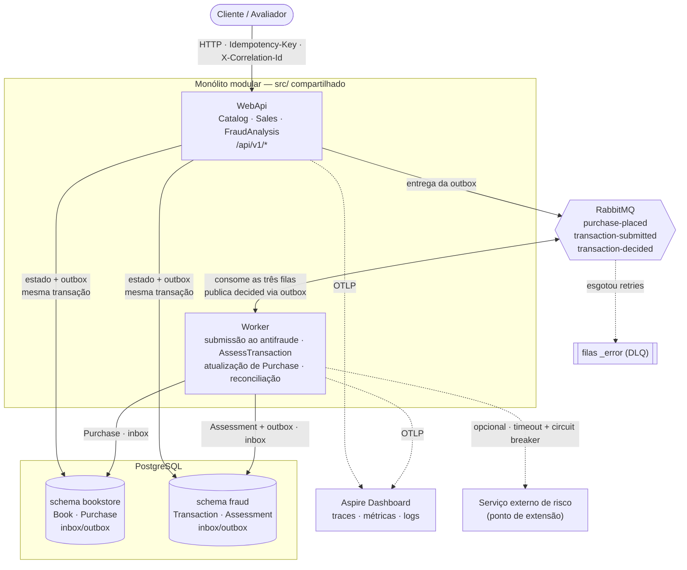
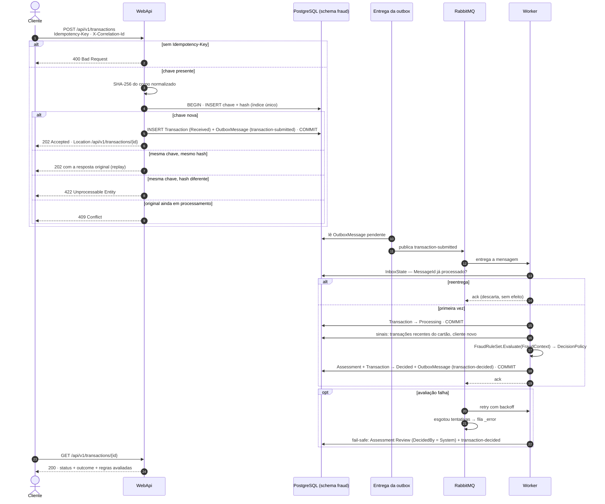

# 📚🛡️ BookStore — Módulo Antifraude

> Um **marketplace de livros** que só confirma uma venda depois que um **módulo antifraude** avalia a
> transação e decide entre `APPROVED`, `REJECTED` ou `REVIEW`. A solução é **idempotente**,
> **resiliente** e **auditável** — e cada uma dessas palavras está provada em código, teste e documento.

**Stack:** .NET 10 · ASP.NET Core · EF Core · PostgreSQL · RabbitMQ · MassTransit · OpenTelemetry ·
Aspire · Docker

---

## 📑 Sumário

- [🎯 O desafio e onde cada item é atendido](#-o-desafio-e-onde-cada-item-é-atendido)
- [🚀 How to use](#-how-to-use)
- [🏗️ Visão geral](#️-visão-geral)
- [🔄 Fluxo de ponta a ponta](#-fluxo-de-ponta-a-ponta)
- [🧠 Regras antifraude](#-regras-antifraude)
- [🛟 Resiliência](#-resiliência)
- [🔁 Idempotência e deduplicação](#-idempotência-e-deduplicação)
- [🔭 Observabilidade](#-observabilidade)
- [🧾 Auditoria](#-auditoria)
- [📜 Contrato de API](#-contrato-de-api)
- [🧭 Decisões arquiteturais (ADRs)](#-decisões-arquiteturais-adrs)
- [🗂️ Estrutura do repositório](#️-estrutura-do-repositório)
- [🧪 Testes](#-testes)
- [🤖 Uso de IA no processo](#-uso-de-ia-no-processo)
- [🔮 Evoluções](#-evoluções)

---

## 🎯 O desafio e onde cada item é atendido

| Item pedido | Onde está |
| :--- | :--- |
| Visão geral (arquitetura, componentes) | [🏗️ Visão geral](#️-visão-geral) · [diagrama de componentes](docs/diagramas/01-componentes.md) |
| Fluxo de ponta a ponta | [🔄 Fluxo](#-fluxo-de-ponta-a-ponta) · [diagramas de sequência](docs/diagramas/02-sequencia.md) |
| Resiliência (retry, backoff, DLQ, fallback) | [🛟 Resiliência](#-resiliência) |
| Idempotência e deduplicação | [🔁 Idempotência](#-idempotência-e-deduplicação) · [ADR-0004](docs/adr/0004-idempotencia-e-deduplicacao.md) |
| Observabilidade (métricas, logs, tracing) | [🔭 Observabilidade](#-observabilidade) · [ADR-0005](docs/adr/0005-observabilidade-e-correlacao.md) |
| Diagrama de componentes/containers | [01-componentes](docs/diagramas/01-componentes.md) |
| Diagrama de sequência | [02-sequencia](docs/diagramas/02-sequencia.md) |
| ADR — mensageria | [ADR-0002](docs/adr/0002-mensageria.md) |
| ADR — banco de dados | [ADR-0003](docs/adr/0003-banco-de-dados.md) |
| ADR — idempotência/dedup | [ADR-0004](docs/adr/0004-idempotencia-e-deduplicacao.md) |
| ADR — deployment *(extra)* | [ADR-0007](docs/adr/0007-deploy.md) |
| `POST /transactions` com `Idempotency-Key` | [contrato](docs/api/contrato.md#post-apiv1transactions) |
| `GET /transactions/{id}` | [contrato](docs/api/contrato.md#get-apiv1transactionsid) |

**Além do pedido:** diagramas de [entidades](docs/diagramas/03-entidades.md) e de
[estados](docs/diagramas/04-estados.md), ADRs de [processamento assíncrono](docs/adr/0001-processamento-assincrono.md),
[versionamento](docs/adr/0006-versionamento-da-api.md) e [regras antifraude](docs/adr/0008-regras-antifraude.md),
marketplace consumidor do antifraude, revisão humana, reconciliação, testes e execução com um comando.

---

## 🚀 How to use

### 📋 Pré-requisitos

- **Docker Desktop 24+** com `docker compose` v2 (incluso)
- Portas livres: `5432` (PostgreSQL), `5672` / `15672` (RabbitMQ), `8080` (WebApi), `18888` / `18889` (Aspire Dashboard)

### ▶️ Subindo o ambiente

```bash
# copie o arquivo de variáveis de ambiente
cp deploy/.env.example deploy/.env

# sobe todos os serviços e aguarda ficarem saudáveis
docker compose -f deploy/docker-compose.yml up -d --wait
```

Na primeira execução o WebApi aplica as migrations e popula o catálogo automaticamente (`Database__ApplyMigrationsOnStartup=true`, `Seeding__Enabled=true`).

### 🔗 Endereços

| Serviço | URL |
| :--- | :--- |
| 📘 Swagger UI | http://localhost:8080/swagger |
| 🔭 Aspire Dashboard | http://localhost:18888 |
| 🐇 RabbitMQ Management | http://localhost:15672 (guest / guest) |

### 📮 Postman

1. Importe `docs/postman/BookStore.postman_collection.json`
2. Importe `docs/postman/local.postman_environment.json` e selecione o ambiente **BookStore — Local**
3. Execute os cenários na ordem abaixo

### 🎬 Roteiro de cenários

| # | Cenário | Resultado esperado | Como executar |
| :---: | :--- | :--- | :--- |
| S1 | livro físico, valor baixo, cliente com histórico | ✅ `APPROVED` → compra `CONFIRMED` | Execute **S1.1** → aguarde ~2 s → execute **S1.2** |
| S2 | e-book caro, cliente novo | ❌ `REJECTED` → compra `CANCELLED` | Execute **S2.1** (Pragmatic ×2, cliente novo) → aguarde → **S2.2** |
| S3 | 10 unidades do mesmo livro | 🔍 `REVIEW` → compra `UNDER_REVIEW` | Execute **S3.1** (Clean Code ×10) → aguarde → **S3.2** |
| S4 | revisor aprova o S3 | ✅ compra `CONFIRMED` | Execute **S4.1** → **S4.2** (outcome APPROVED) → **S4.3** |
| S5 | 5 compras seguidas com o mesmo cartão | primeiras aprovadas, 6ª barrada | Execute **S5.1–S5.5** (histórico) → **S5.6** → aguarde → **S5.7** |
| S6 | reenvio com a mesma `Idempotency-Key` | 🔁 mesma resposta, nenhuma compra nova | Execute **S6** (usa a chave salva de S1) |
| S7 | mesma chave, corpo diferente | ⚠️ `422` | Execute **S7** (mesma chave de S1, body diferente) |
| S8 | sem `Idempotency-Key` | ⚠️ `400` | Execute **S8** |
| S9 | parar o Worker, comprar, religar | 🛟 compra conclui sozinha ao religar | `docker compose -f deploy/docker-compose.yml stop worker` → faça uma compra → `docker compose -f deploy/docker-compose.yml start worker` → aguarde → compra finaliza |
| S10 | valor muito acima da média do cliente | 🔍 `REVIEW` | Execute **S10.1–S10.3** (histórico) → aguarde → **S10.4** → **S10.5** |
| S11 | três compras logo abaixo de um limite | 🔍 `REVIEW` | Execute **S11.1–S11.3** (R$ 475, R$ 480, R$ 490) → aguarde → **S11.4** |

---

## 🏗️ Visão geral

**Monólito modular** com dois serviços lógicos — o **marketplace** (catálogo e vendas) e o
**antifraude** — compartilhando o mesmo código-fonte (`src/`) e implantados como dois processos:

- **WebApi** — só HTTP: recebe, valida, garante a idempotência, grava e responde `202`.
- **Worker** — só assíncrono: avalia transações, atualiza compras, reconcilia pendências.

Cada serviço é dono do seu schema no PostgreSQL (`bookstore` e `fraud`). A comunicação entre eles é
sempre uma mensagem no RabbitMQ, via outbox transacional. O marketplace nunca referencia o antifraude
diretamente: depende de uma porta própria (`IFraudCheckGateway`) — separá-los fisicamente no futuro é
trocar um adaptador.

<!-- sincronizado de docs/diagramas/01-componentes.md -->


📄 Detalhes e justificativas: [diagrama de componentes](docs/diagramas/01-componentes.md) ·
[entidades](docs/diagramas/03-entidades.md) · [estados](docs/diagramas/04-estados.md)

---

## 🔄 Fluxo de ponta a ponta

1. O cliente envia `POST /api/v1/transactions` com `Idempotency-Key`.
2. A API grava **na mesma transação de banco** a chave, a transação (`Received`) e a mensagem de saída,
   e responde `202 Accepted` + `Location`.
3. A outbox entrega `transaction-submitted` ao RabbitMQ.
4. O Worker consome (a inbox descarta reentregas), marca `Processing`, monta o contexto com os sinais
   históricos e executa as regras.
5. A política converte a pontuação em decisão; o Worker grava a avaliação e publica
   `transaction-decided` — de novo, na mesma transação.
6. O cliente consulta `GET /api/v1/transactions/{id}`; o marketplace reage ao evento e confirma,
   cancela ou envia a compra para revisão.

<!-- sincronizado de docs/diagramas/02-sequencia.md (fluxo 1) -->


📄 A compra de ponta a ponta (marketplace → antifraude → marketplace) está no
[fluxo 2](docs/diagramas/02-sequencia.md#2-compra-de-livro-de-ponta-a-ponta).

---

## 🧠 Regras antifraude

Cada regra é uma classe que implementa `IFraudRule`. O `FraudRuleSet` executa todas e soma os pesos; a
`DecisionPolicy` converte a pontuação em `APPROVED`, `REVIEW` ou `REJECTED`. As regras são puras (sem
acesso a banco) e cada uma registra código, versão, peso e motivo — disparando ou não.

| Regra | Detecta | Cenário |
| :--- | :--- | :---: |
| `HighValueDigitalRule` | valor alto em entrega digital | S2 |
| `NewCustomerHighAmountRule` | cliente sem histórico com valor alto | S2 |
| `BulkQuantityRule` | muitas unidades do mesmo item | S3 |
| `CardVelocityRule` | muitas transações do mesmo cartão em pouco tempo | S5 |
| `AmountDeviationRule` | valor muito acima da média do próprio cliente | S10 |
| `StructuringRule` | fracionamento logo abaixo de um limite | S11 |

📄 [ADR-0008 — Regras antifraude](docs/adr/0008-regras-antifraude.md)

---

## 🛟 Resiliência

| Mecanismo | O que faz |
| :--- | :--- |
| 📤 **Outbox transacional** | estado e mensagem gravados juntos; se o broker cair, a mensagem espera na tabela |
| 🔁 **Retry com backoff** | reprocessa falhas passageiras em intervalos crescentes |
| ☠️ **DLQ** (filas `_error`) | guarda a mensagem que esgotou as tentativas, sem perdê-la |
| 🧯 **Fallback fail-safe** | se a avaliação falha de vez, a transação recebe `REVIEW` (decidida pelo sistema) — nunca aprovação às cegas |
| 🧹 **Reconciliação** | job que republica compras paradas em `PENDING_FRAUD_CHECK` — seguro por idempotência |

📄 [ADR-0001](docs/adr/0001-processamento-assincrono.md) · [ADR-0002](docs/adr/0002-mensageria.md)

---

## 🔁 Idempotência e deduplicação

Repetir qualquer operação, em qualquer ponto, produz o mesmo resultado que executá-la uma vez.

| Onde | Mecanismo |
| :--- | :--- |
| `POST` de transações e compras | `Idempotency-Key` + hash do corpo, gravados na mesma transação do dado (índice único) |
| Consumidores | inbox (descarta o mesmo `MessageId`) |
| Casos de uso | checagem de estado antes de agir |
| Marketplace → antifraude | `Idempotency-Key = PurchaseId` |
| Reconciliação | republica com a mesma chave |

Respostas HTTP conforme o draft IETF `Idempotency-Key`: `400` sem chave · replay com a mesma chave e o
mesmo corpo · `422` com corpo diferente · `409` com a original ainda em execução.

📄 [ADR-0004 — Idempotência e deduplicação](docs/adr/0004-idempotencia-e-deduplicacao.md)

---

## 🔭 Observabilidade

- **Tracing** — OpenTelemetry, com `traceparent` atravessando HTTP e RabbitMQ: uma compra é um trace.
- **Logs estruturados** — *message templates* com `CorrelationId`, ids de recurso e `TraceId`; nunca
  dado de cartão.
- **Métricas** — técnicas (HTTP, banco, fila) e de negócio: transações recebidas, decisões por
  resultado, disparos por regra, tempo até a decisão, compras por status, reenvios idempotentes.
- **Correlação** — `X-Correlation-Id` no header; persistido e propagado. O `traceId` descreve uma
  execução; o `CorrelationId`, o fluxo de negócio inteiro (inclusive revisão e reconciliação).

📄 [ADR-0005 — Observabilidade e correlação](docs/adr/0005-observabilidade-e-correlacao.md)

---

## 🧾 Auditoria

- Decisões **nunca são sobrescritas**: cada avaliação é um novo registro; a vigente é a mais recente.
- Cada avaliação guarda **quem decidiu** (motor, sistema ou revisor), **quando**, **pontuação** e o
  resultado de **todas** as regras, com código, **versão** e motivo.
- O `GET /api/v1/transactions/{id}` expõe a decisão vigente e o histórico completo.

---

## 📜 Contrato de API

Base path `/api/v1`. Erros em *Problem Details* (RFC 9457).

| Serviço | Endpoint | |
| :--- | :--- | :---: |
| 🛡️ Antifraude | `POST /api/v1/transactions` | exigido |
| 🛡️ Antifraude | `GET /api/v1/transactions/{id}` | exigido |
| 🛡️ Antifraude | `POST /api/v1/transactions/{id}/review` | extra |
| 📚 Marketplace | `GET /api/v1/books` | extra |
| 📚 Marketplace | `POST /api/v1/purchases` | extra |
| 📚 Marketplace | `GET /api/v1/purchases/{id}` | extra |

📄 [Contrato completo](docs/api/contrato.md)

---

## 🧭 Decisões arquiteturais (ADRs)

| ADR | Decisão |
| :--- | :--- |
| [0001](docs/adr/0001-processamento-assincrono.md) | Processamento assíncrono com outbox |
| [0002](docs/adr/0002-mensageria.md) | RabbitMQ + MassTransit |
| [0003](docs/adr/0003-banco-de-dados.md) | PostgreSQL, dois schemas, EF Core |
| [0004](docs/adr/0004-idempotencia-e-deduplicacao.md) | Idempotência em cinco pontos |
| [0005](docs/adr/0005-observabilidade-e-correlacao.md) | OpenTelemetry e correlação |
| [0006](docs/adr/0006-versionamento-da-api.md) | Versionamento por URL |
| [0007](docs/adr/0007-deploy.md) | Containers + compose; Kubernetes em produção *(extra)* |
| [0008](docs/adr/0008-regras-antifraude.md) | Regras antifraude |

---

## 🗂️ Estrutura do repositório

```text
apps/
  AppHost/          orquestração de desenvolvimento (Aspire)
  WebApi/           HTTP — marketplace e antifraude
  Worker/           consumidores, reconciliação, limpeza
src/
  Domain/           entidades e regras, por contexto (Catalog, Sales, FraudAnalysis)
  Application/      casos de uso: UseCases/<Contexto>/<CasoDeUso>/
  Infrastructure/   Persistence/<DbContext>/ · Extensions/
tests/              Tests.Shared · Tests.Domain · Tests.Application · Tests.WebApi ·
                    Tests.Worker · Tests.Infrastructure
deploy/             docker-compose.yml · .env.example
docs/               adr/ · diagramas/ · api/ · postman/
```

---

## 🧪 Testes

```bash
# unitários (sem Docker — rápido):
dotnet test BookStore.slnx --filter "TestCategory=Unit"

# integrados (requer Docker — Testcontainers sobe PostgreSQL automaticamente):
dotnet test BookStore.slnx

# apenas infraestrutura (models, migrations):
dotnet test tests/Tests.Infrastructure

# apenas um contexto:
dotnet test tests/Tests.Application
```

Cobertura por camada: **Domain** (invariantes de entidades, regras de fraude), **Application** (handlers com repositórios substituídos), **WebApi** (serialização, idempotência HTTP), **Infrastructure** (configuração dos modelos EF, idempotência em banco real).

---

## 🤖 Uso de IA no processo

> ⏳ **A preencher.**

---

## 🔮 Evoluções

- ☸️ **Kubernetes** — API com autoescala por requisições; Worker por tamanho da fila (KEDA).
- 🧮 **Parâmetros de regra externos** — com versão derivada do hash dos parâmetros.
- 🤖 **Score de machine learning** — como mais uma `IFraudRule`, sem mudar a arquitetura.
- 🤝 **Conluio comprador–vendedor** — exige modelar vendedores no marketplace.
- 🔐 **Autenticação** — revisor identificado pelo token; `fraudDetails` restrito a operadores de risco.
