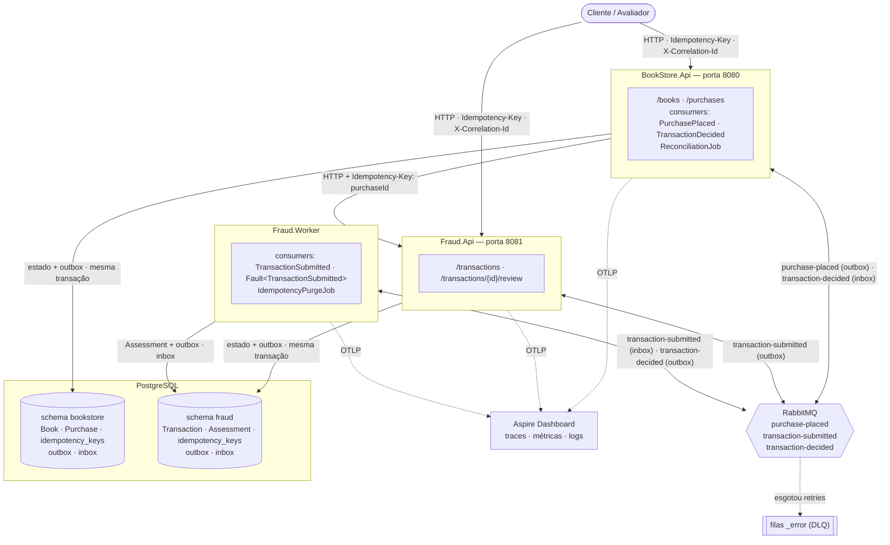

# Diagrama de componentes

Três processos independentes compartilham o mesmo código de domínio e aplicação (`src/`), com dois
bounded contexts — **BookStore** (catálogo + compras) e **Fraud** (análise antifraude). Comunicação
assíncrona via RabbitMQ (MassTransit outbox/inbox) e comunicação síncrona via HTTP entre
`BookStore.Api` → `Fraud.Api`. Veja ADR-0010 para a motivação da divisão.

## Componentes

| Componente | Responsabilidade |
| :--- | :--- |
| **BookStore.Api** | Catálogo de livros e marketplace de compras. Recebe `POST /purchases`, aplica idempotência, grava estado + outbox (BookStoreDbContext) e responde `202 Accepted`. Consome `PurchasePlaced` (chama Fraud.Api via HTTP) e `TransactionDecided` (atualiza `Purchase`). Roda a reconciliação. |
| **Fraud.Api** | Recebe `POST /transactions`, aplica idempotência, grava estado + outbox (FraudDbContext) e responde `202 Accepted`. Recebe `POST /transactions/{id}/review` para revisão manual. |
| **Fraud.Worker** | Consome `TransactionSubmitted` (avalia a transação com as regras antifraude) e `Fault<TransactionSubmitted>` (fail-safe → REVIEW). Roda a limpeza de chaves de idempotência. |
| **PostgreSQL** | Um banco, dois schemas — um por contexto. Cada schema tem inbox/outbox e migrations independentes. |
| **RabbitMQ** | Transporte das mensagens. Filas `_error` recebem o que esgotou as tentativas. Dados persistidos em volume `rabbitmq-data`. |
| **Aspire Dashboard** | Recebe OpenTelemetry (OTLP) dos três processos. Mostra o trace de uma compra de ponta a ponta, incluindo o salto HTTP entre BookStore.Api e Fraud.Api. |

## Por que é assim

### Dois APIs + um Worker, um repositório

A divisão em três processos resolve o bug de race condition do MassTransit 8.5.x ao registrar dois
outboxes no mesmo bus (ver ADR-0010). Cada processo tem exatamente um `DbContext` e um
`AddEntityFrameworkOutbox`, tornando `UseBusOutbox()` seguro.

É um único código-fonte com fronteiras de contexto explícitas. O `BookStore.Api` não conhece o
`FraudDbContext` nem o contrário. Se um contexto precisar de um banco separado em produção, é apenas
uma troca de connection string.

### Comunicação síncrona via HTTP (BookStore.Api → Fraud.Api)

O `PurchasePlacedConsumer` chama `POST /api/v1/transactions` na Fraud.Api com
`Idempotency-Key: {purchaseId}`. A resilience handler (`AddStandardResilienceHandler`) adiciona retry,
circuit breaker e timeout. O trace atravessa HTTP via `traceparent`, mantendo visibilidade ponta a ponta.

### Outbox transacional e inbox no consumidor

Cada outbox garante entrega **pelo menos uma vez** dentro do seu processo. A inbox do MassTransit
descarta reentregas por `MessageId`. As duas camadas juntas garantem exatamente uma execução efectiva
para cada mensagem.

### Observabilidade por padrão aberto

Todos os três processos emitem OpenTelemetry. O `X-Correlation-Id` segue nos headers HTTP e nas
mensagens de broker. O Aspire Dashboard mostra o trace de uma compra desde o `POST /purchases` até a
atualização do status final em `BookStore.Api`.
