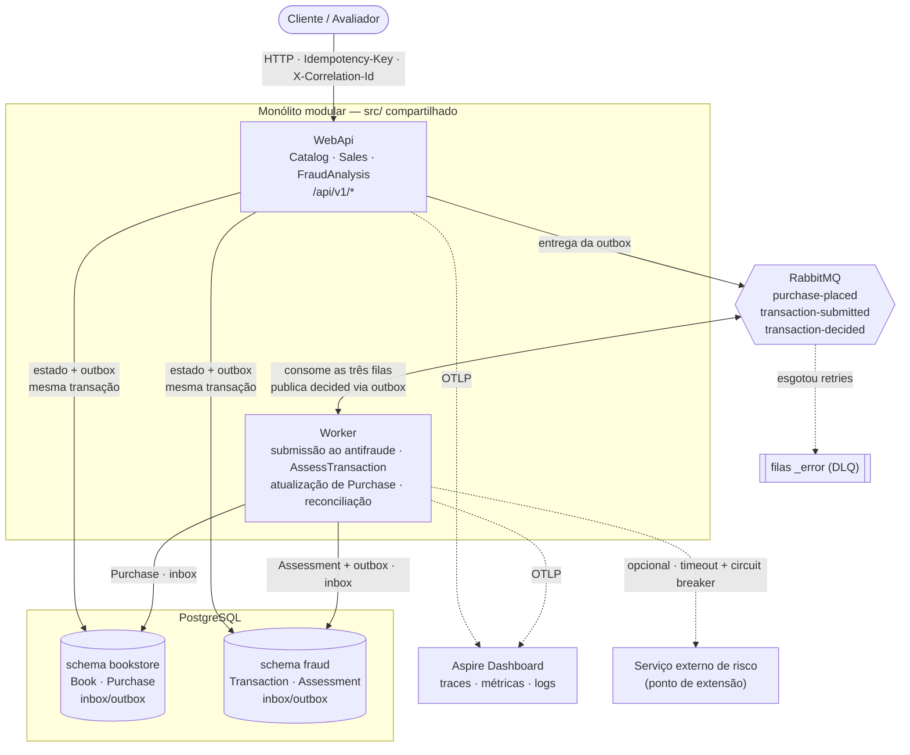

# Diagrama de componentes

Monólito modular: uma API HTTP e um Worker compartilham o mesmo código de domínio e aplicação
(`src/`), com três contextos delimitados — **Catalog**, **Sales** e **FraudAnalysis**. Toda comunicação
assíncrona passa pelo RabbitMQ via MassTransit, com outbox e inbox transacionais no PostgreSQL.

## Componentes

| Componente | Responsabilidade |
| :--- | :--- |
| **WebApi** | Só HTTP. Recebe a requisição, valida, aplica a idempotência, grava estado + outbox e responde. Não executa regra antifraude. |
| **Worker** | Só assíncrono. Consome `purchase-placed` (submete ao antifraude), `transaction-submitted` (avalia a transação) e `transaction-decided` (atualiza a `Purchase`); roda a reconciliação e a limpeza de chaves de idempotência. |
| **PostgreSQL** | Um banco, dois schemas — um por contexto com dados. Cada schema tem suas próprias tabelas de inbox/outbox e seu histórico de migrations. |
| **RabbitMQ** | Transporte das mensagens. Filas `_error` recebem o que esgotou as tentativas. |
| **Aspire Dashboard** | Recebe OpenTelemetry (OTLP) da API e do Worker. Mostra o trace de uma compra de ponta a ponta. |
| **Serviço externo de risco** | Ponto de extensão, não implementado: bureau, lista de cartões bloqueados, geolocalização de IP. |

## Por que é assim

### Monólito modular, não microsserviços

É um único código-fonte com fronteiras de contexto explícitas. O Sales não referencia o FraudAnalysis:
depende de uma porta própria (`IFraudCheckGateway`) cujo adaptador chama o caso de uso em processo.
Se o antifraude precisar virar um serviço, troca-se o adaptador por um cliente HTTP — nenhum outro
código muda. Dois deploys independentes agora seriam custo sem necessidade medida.

### API e Worker separados

A API responde rápido (`202 Accepted`) e não depende da latência das regras. O Worker escala de
forma independente conforme o volume da fila. Uma falha no processamento não derruba a recepção de
novas transações.

### Outbox transacional

A mudança de estado e a mensagem a publicar são gravadas **na mesma transação do PostgreSQL**. Isso
elimina a escrita dupla: não existe transação gravada sem mensagem, nem mensagem sem transação. Um
serviço de entrega do MassTransit lê a outbox e publica no RabbitMQ; se o broker estiver fora, a
mensagem espera na tabela.

### Inbox no consumidor

A outbox garante entrega **pelo menos uma vez** — uma mensagem pode chegar duas vezes. A inbox trava
cada `MessageId` recebido e descarta reentregas. É a segunda camada de deduplicação, complementar à
`Idempotency-Key` da API.

### Um banco, dois schemas

Isola os contextos (cada `DbContext` só enxerga o seu schema) sem o custo de dois servidores.
Em produção, cada contexto teria seu próprio banco; a separação por schema torna essa migração uma
troca de connection string.

### Observabilidade por padrão aberto

API e Worker emitem OpenTelemetry. O contexto de trace (`traceparent`) atravessa HTTP e RabbitMQ, e o
`CorrelationId` segue nas mensagens e nos logs. O Aspire Dashboard é só o visualizador desta
demonstração; trocar por Jaeger, Grafana ou outro backend é mudar um endereço de configuração.

### Integrações externas como ponto de extensão

Um antifraude real costuma consultar provedores externos (bureau de crédito, lista de cartões
bloqueados, geolocalização de IP). A consulta **não** acontece dentro de uma regra — as regras são
puras. Ela acontece no caso de uso que monta o `FraudContext`, como mais um sinal, protegida por
**timeout** e **circuit breaker**. Se o provedor estiver fora, o sinal chega como "indisponível", a regra
que depende dele registra que não pôde avaliar, e a avaliação segue com as demais regras — a falha de
um fornecedor nunca derruba o antifraude.
