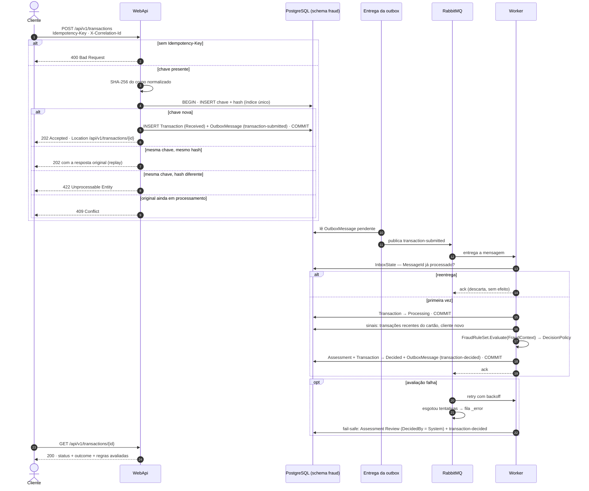
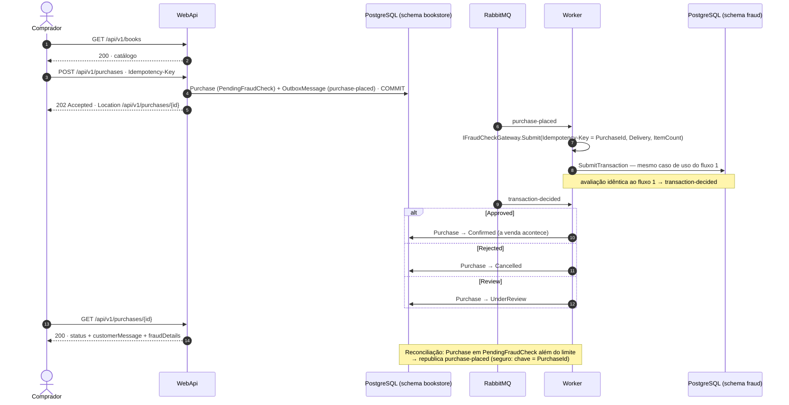

# Diagramas de sequência

Dois fluxos. O primeiro é o exigido pelo desafio: uma transação chegando pelo contrato
`POST /api/v1/transactions` até a decisão. O segundo mostra o marketplace de livros consumindo o antifraude — como os
contextos se conectam numa compra de ponta a ponta.

## 1. Processamento de uma transação

### Pontos-chave

- **Passos 4 e 5 são atômicos.** Chave de idempotência, transação e mensagem de saída entram na mesma
  transação do banco — ou tudo, ou nada. Não existe transação sem mensagem nem mensagem sem transação.
- **A API não avalia nada.** Ela aceita, garante a idempotência e responde `202`. A avaliação é
  assíncrona, no Worker; o cliente acompanha pelo `GET` (passo 23).
- **Duas camadas de deduplicação.** Na entrada, a `Idempotency-Key` barra reenvios do cliente. No
  consumo, a inbox barra reentregas do broker — a outbox garante entrega *pelo menos uma vez*, então
  a mesma mensagem pode chegar duas vezes.
- **`Processing` é gravado antes de avaliar.** O `GET` mostra que a transação está em andamento, e uma
  falha no meio da avaliação deixa rastro no estado.
- **Fail-safe.** Se a avaliação esgota as tentativas, a transação não fica sem decisão nem é aprovada
  às cegas: recebe `Review` com `DecidedBy = System` e vai para análise humana.

## 2. Compra de livro de ponta a ponta

### Pontos-chave

- **Cada transação de banco toca um schema só.** A API grava apenas em `bookstore`; o Worker grava em
  `fraud` ao submeter e em `bookstore` ao receber a decisão. A ponte entre os contextos é sempre uma
  mensagem, nunca uma transação distribuída.
- **O `PurchaseId` é a chave de idempotência da transação.** Por isso a reconciliação pode republicar
  a compra quantas vezes for preciso: se a transação já existe, o antifraude devolve a mesma.
- **Só existe venda com `Approved`.** `Confirmed` só é alcançado por um `transaction-decided` aprovado —
  do motor ou de um revisor.
- **Dois públicos, campos separados.** O comprador lê `customerMessage` (genérica); `fraudDetails`
  mostra as regras e os motivos. Em produção, `fraudDetails` ficaria restrito a operadores de risco.
