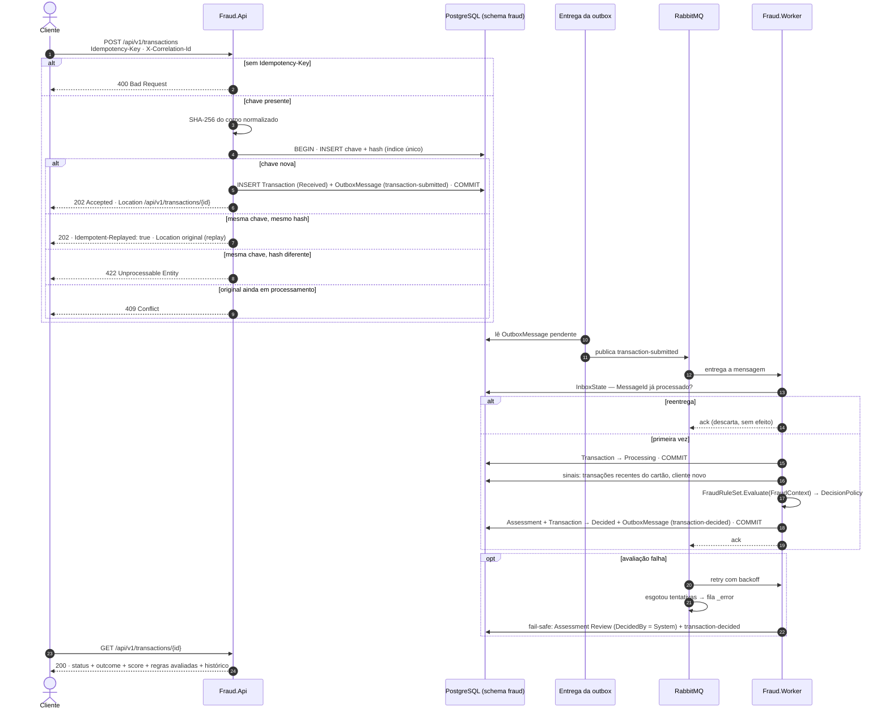
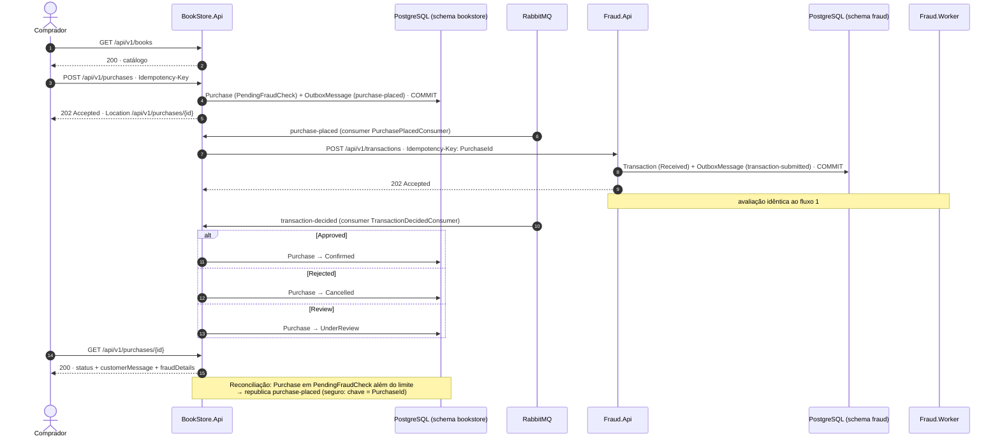

# Diagramas de sequência

Dois fluxos. O primeiro mostra uma transação chegando pelo `POST /api/v1/transactions` até a decisão.
O segundo mostra o marketplace de livros consumindo o antifraude via HTTP — como os três processos
cooperam numa compra de ponta a ponta.

## 1. Processamento de uma transação (Fraud.Api + Fraud.Worker)

### Pontos-chave

- **Passos 4 e 5 são atômicos.** Chave de idempotência, transação e mensagem de saída entram na mesma
  transação do banco — ou tudo, ou nada.
- **Fraud.Api não avalia nada.** Ela aceita, garante a idempotência e responde `202`. A avaliação é
  assíncrona no Fraud.Worker.
- **Replay devolve o mesmo status + Location + `Idempotent-Replayed: true`.** O cliente que recebeu `202`
  e reenvia obtém exatamente o mesmo resultado, sem reprocessar.
- **Fail-safe.** Se a avaliação esgota as tentativas, a transação recebe `Review` com
  `DecidedBy = System` e vai para análise humana.

## 2. Compra de livro de ponta a ponta (BookStore.Api → Fraud.Api → Fraud.Worker)

### Pontos-chave

- **Comunicação síncrona via HTTP entre BookStore.Api e Fraud.Api.** O `PurchasePlacedConsumer`
  chama `POST /api/v1/transactions` com `Idempotency-Key: PurchaseId`. Se Fraud.Api estiver fora,
  MassTransit retenta o consumer com backoff.
- **Cada transação de banco toca um schema só.** A API grava apenas em `bookstore`; a decisão final
  chega via mensagem `transaction-decided`, nunca via transação distribuída.
- **O `PurchaseId` é a chave de idempotência da transação.** Por isso a reconciliação pode republicar
  a compra quantas vezes for preciso sem criar transações duplicadas.
- **Trace ponta a ponta.** `X-Correlation-Id` atravessa HTTP e mensagens; o Aspire Dashboard mostra
  um único trace de `POST /purchases` até a atualização de `Purchase`.
