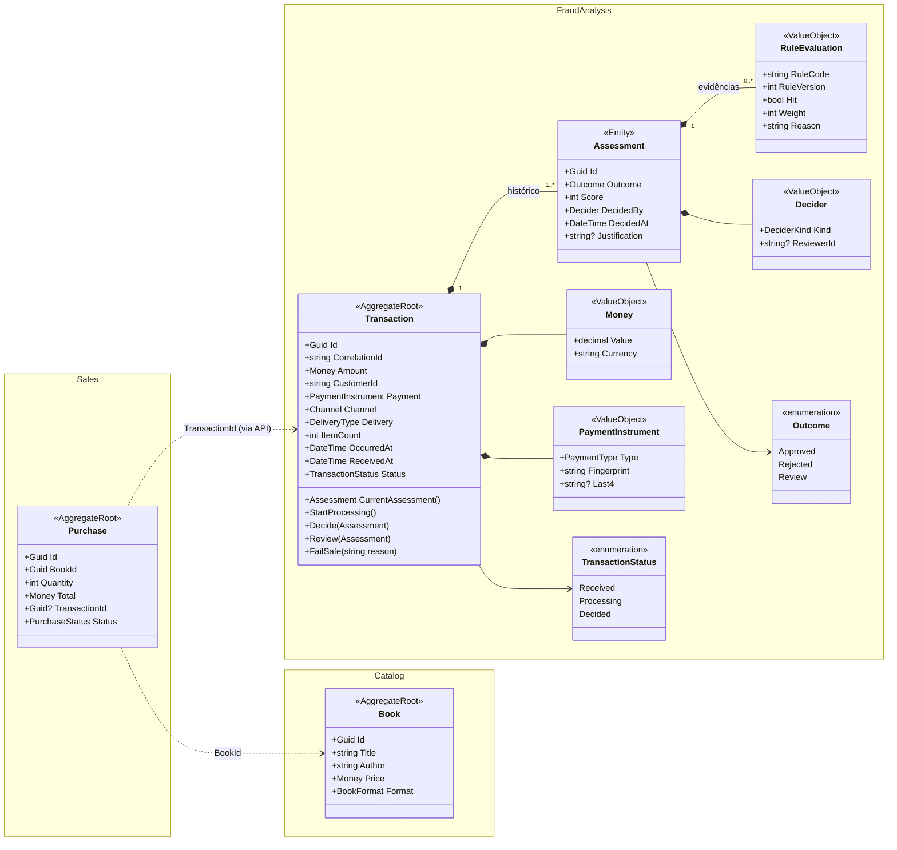
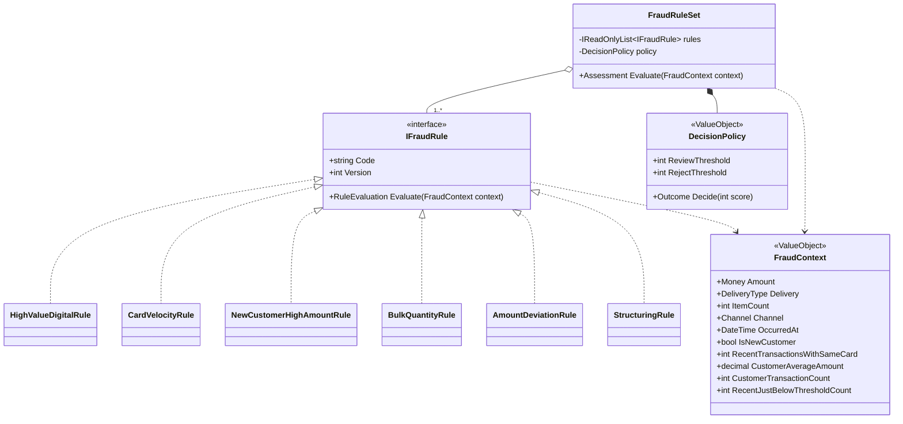

# Diagrama de entidades

Modelo de domínio dos três contextos delimitados (*bounded contexts*) do BookStore. O antifraude
(**FraudAnalysis**) é o protagonista; **Catalog** e **Sales** existem para dar um cliente real ao contrato
`POST /api/v1/transactions`.

## Por que o modelo é assim

### Um agregado só: `Transaction` contém seus `Assessments`

A decisão só tem significado junto da transação que ela avalia, e o volume por transação é pequeno —
uma avaliação do motor e, no máximo, uma revisão humana. Um agregado único dá consistência forte na
escrita sem custo real. Separar `Assessment` em agregado próprio traria consistência eventual entre
os dois para resolver um problema de escala que este domínio não tem.

### `Status` e `Outcome` são campos diferentes

`Status` responde **em que etapa do processamento a transação está**; `Outcome` responde **qual foi a
decisão**. Misturar os dois num enum só (`PROCESSING`, `REJECTED`, …) produz estados impossíveis de
interpretar — uma transação `REVIEW` está decidida ou em processamento? Separados, a resposta do
`GET /api/v1/transactions/{id}` fica inequívoca: `status: Decided`, `outcome: Review`.

### A decisão nunca é sobrescrita (auditabilidade)

`Assessments` são *append-only*. Quando um revisor humano resolve um `Review`, o sistema **acrescenta**
um novo `Assessment` com `DecidedBy = Reviewer` e uma `Justification` obrigatória; o original
permanece. A decisão vigente é sempre a mais recente (`CurrentAssessment()`). Isso responde, a
qualquer momento, *quem decidiu o quê, quando e por quê*.

### Não existe estado `Failed`

Uma falha na avaliação é tratada por retry (a transação continua em `Processing` e é reprocessada) e,
esgotadas as tentativas, pelo fail-safe (`FailSafe` grava um `Assessment` com `Outcome = Review` e
`DecidedBy = System`, levando a `Decided`). Nenhum fluxo deixaria a transação parada em `Failed` —
seria um estado que existe no código mas nunca é alcançado. O motivo técnico da falha fica no
`Assessment` do sistema e nos logs.

### Não existe entidade `ManualReview`

A revisão humana é um `Assessment` feito por um revisor. Uma entidade à parte guardaria o mesmo dado
(resultado, autor, data, justificativa) em dois lugares, e os dois poderiam divergir.

### `RuleEvaluation` guarda a versão da regra

Cada avaliação registra `RuleCode`, `RuleVersion`, se a regra disparou (`Hit`), o peso e o motivo.
Com a versão gravada, é possível explicar uma rejeição de meses atrás mesmo que a regra já tenha
mudado — sem isso, a auditoria reconstruiria a decisão com a regra errada.

### `CorrelationId` é persistido na transação

O `CorrelationId` rastreia o fluxo entre API, fila, worker e logs. Guardá-lo também na transação
permite ir do registro no banco para todos os logs do fluxo (e vice-versa). Ele **não** é a chave de
idempotência nem o identificador do recurso — são três identificadores com papéis distintos:

| Identificador | Papel | Origem |
| :--- | :--- | :--- |
| `Idempotency-Key` | deduplicar a mesma requisição reenviada | cliente |
| `TransactionId` | identidade do recurso | sistema |
| `CorrelationId` | rastrear o fluxo ponta a ponta | quem entra primeiro (cliente ou API) |

### Os contextos só se referenciam por id

`Purchase` guarda um `TransactionId` recebido da API; não conhece a classe `Transaction`. `Purchase`
guarda um `BookId`; não carrega o `Book`. As linhas tracejadas no diagrama marcam essas fronteiras.
Cada contexto pode mudar seu modelo interno sem quebrar os outros.

### O registro de idempotência não está aqui

Chave, hash do payload e resposta armazenada são preocupações da camada de aplicação e da
infraestrutura (HTTP e persistência), não regras de negócio do antifraude. Colocá-los no domínio
faria o domínio conhecer detalhes de transporte. O tratamento está no ADR-0004.

### Dados de pagamento chegam como `Fingerprint`

`PaymentInstrument` carrega um *fingerprint* (hash do token do cartão) e, no máximo, os quatro
últimos dígitos. O antifraude precisa reconhecer o **mesmo cartão** em transações diferentes, não
conhecer o número dele. Isso mantém o módulo fora do escopo de dados sensíveis de cartão.

### `Book.Format` vira `Transaction.Delivery` na fronteira

E-book é entregue na hora e não tem endereço de entrega para conferir; por isso pesa mais no risco
do que um livro físico. Mas o antifraude **não conhece livros**: ao chamar a API, o marketplace traduz
`Format` em `Delivery` (`Digital` ou `Physical`) e envia a quantidade em `ItemCount`. Assim o módulo
serve para qualquer loja que venda algo digital ou físico, não só para esta.

## Invariantes do agregado `Transaction`

| # | Regra |
| :--- | :--- |
| I-01 | `Amount.Value` > 0 |
| I-02 | Transições permitidas: `Received → Processing → Decided`. Reentrar em `Processing` é permitido (retry reprocessa) |
| I-03 | Assessment do motor só é aceito em `Processing` |
| I-04 | Assessment de revisor só é aceito quando `Status = Decided` e o `Outcome` vigente é `Review` |
| I-05 | Assessment de revisor exige `Justification` e não pode ter `Outcome = Review` |
| I-06 | Assessments são imutáveis; a decisão vigente é a mais recente |
| I-07 | Assessment do sistema (fail-safe, `DecidedBy = System`) só existe com `Outcome = Review` e só é aceito em `Processing` |

## Regras antifraude

Cada regra é uma classe que implementa `IFraudRule`; o conjunto de regras aplica todas e a política de
decisão transforma a pontuação em resultado.

| Regra | Dispara quando | Por que é sinal de fraude |
| :--- | :--- | :--- |
| `HighValueDigitalRule` | entrega digital acima de um valor | bem digital é entregue na hora e revendido sem rastro |
| `CardVelocityRule` | muitas transações do mesmo cartão em pouco tempo | padrão de teste de cartão roubado |
| `NewCustomerHighAmountRule` | cliente novo com valor alto | conta criada só para a fraude |
| `BulkQuantityRule` | muitas unidades do mesmo item | revenda com cartão de terceiros |
| `AmountDeviationRule` | valor muito acima da média do próprio cliente | desvio do padrão de consumo |
| `StructuringRule` | várias compras logo abaixo de um limite, em janela curta | fracionamento para escapar de limites (padrão de lavagem) |

Catálogo completo, sinais e critérios: ADR-0008.

### Por que é assim

**Uma classe por regra (Strategy).** Cada regra tem uma responsabilidade, é testada isoladamente e
entra no sistema sem mudar as outras. Adicionar uma regra é criar uma classe e registrá-la — o
conjunto e a política não mudam (aberto para extensão, fechado para modificação).

**As regras são funções puras sobre `FraudContext`.** A `CardVelocityRule` precisa saber quantas
transações o cartão fez nos últimos minutos, o que exige consulta ao banco. Em vez de a regra acessar
o repositório, o caso de uso `AssessTransaction` monta o `FraudContext` com esses sinais já
calculados. Resultado: regras sem I/O, determinísticas e testáveis com dados em memória; o custo de
consulta fica num só lugar, onde pode ser otimizado.

**`FraudRuleSet` compõe, `DecisionPolicy` decide.** O conjunto só executa as regras e soma os pesos;
a política só converte pontuação em `Outcome` (`score ≥ RejectThreshold → Rejected`,
`score ≥ ReviewThreshold → Review`, senão `Approved`). Separados, dá para mudar os limites de
decisão sem tocar nas regras, e vice-versa.

**Toda regra registra o resultado, disparando ou não.** O `Assessment` guarda um `RuleEvaluation` por
regra executada, inclusive as que não dispararam. A auditoria precisa provar também o que **foi
verificado e passou**, não só o que reprovou.

**`Version` é propriedade da regra.** Quando a lógica ou os parâmetros padrão de uma regra mudam, a
versão sobe. É esse número que o `RuleEvaluation` grava.

**Parâmetros são constantes na classe da regra.** Limites como "valor alto" ou "N transações em M
minutos" ficam no código, junto da lógica. Assim a versão nunca descola do comportamento: mudar um
limite é um commit que também sobe o `Version`. Parâmetros em configuração (`IOptions<T>`) permitiriam
ajuste sem deploy, mas abririam uma lacuna de auditoria — o limite mudaria e a versão gravada não.
Evolução prevista: parâmetros externos com a versão derivada de um hash dos parâmetros.
