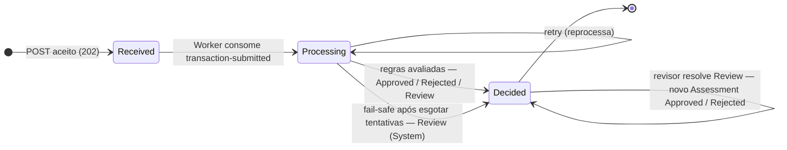
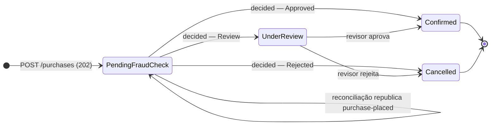

# Diagramas de estados

Dois ciclos de vida: a `Transaction` (antifraude) e a `Purchase` (marketplace). A ligação entre eles é
o evento `transaction-decided`.

## Transaction

`Status` diz **em que etapa** a transação está; `Outcome` (no `Assessment` vigente) diz **qual foi a
decisão**. São campos separados.

| Transição | Quem provoca | Invariante |
| :--- | :--- | :--- |
| `Received → Processing` | Worker, ao consumir a mensagem | I-02 |
| `Processing → Processing` | retry do MassTransit | I-02 |
| `Processing → Decided` (motor) | `FraudRuleSet` + `DecisionPolicy` | I-03 |
| `Processing → Decided` (fail-safe) | tentativas esgotadas | I-07 |
| `Decided → Decided` (revisão) | revisor humano, só se o vigente é `Review` | I-04, I-05 |

## Purchase

| Estado | Significado para o negócio |
| :--- | :--- |
| `PendingFraudCheck` | compra registrada, **ainda não é venda** — não conta, não entrega |
| `Confirmed` | **a venda aconteceu** — único estado que conta como venda |
| `Cancelled` | compra recusada; o comprador recebe mensagem genérica |
| `UnderReview` | aguardando decisão humana |

## Por que é assim

**Só existe venda com `Approved`.** `Confirmed` só é alcançado por um `transaction-decided` aprovado —
do motor ou do revisor. Não há outro caminho no código.

**Nenhuma compra fica esquecida.** `PendingFraudCheck` tem saída garantida: se a mensagem se perdeu, a
reconciliação republica; se a avaliação falhou de vez, o fail-safe produz `Review` e a compra vai para
`UnderReview`. Nenhum dos dois caminhos aprova às cegas.

**Não há estado de falha parado.** Falhas técnicas não viram estado de negócio: são absorvidas por
retry, fail-safe e reconciliação. O motivo técnico fica no `Assessment` do sistema e nos logs.

**Estados finais são finais.** `Confirmed` e `Cancelled` não mudam. Estorno ou cancelamento posterior
seria um novo fluxo, fora do escopo deste desafio.
